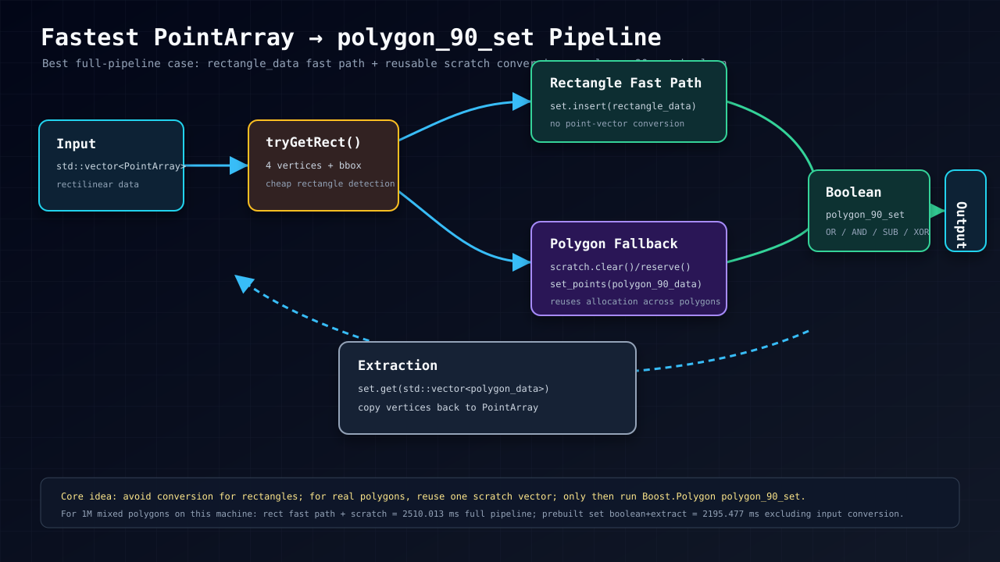

# hello-git
깃허브 테스트

github test 
branch is good
HAHAHA

## Boost.Polygon 1.63 custom point ops

`boost_polygon_custom_point_ops.cpp` contains a C++11 / Boost.Polygon 1.63 example that:

- uses a custom `Point` object through Boost.Polygon point traits
- classifies polygons as `Polygon90`, `Polygon45`, or `AnyAngle`
- runs Boolean `OR`, `AND`, `SUB`, `XOR`
- runs size up/down through Boost.Polygon 1.63 `resize()` APIs
- returns fractured no-hole polygons only

Build:

```sh
c++ -std=c++11 boost_polygon_custom_point_ops.cpp -o boost_polygon_custom_point_ops
```

If Boost 1.63 is not in the compiler default include path:

```sh
c++ -std=c++11 -I/path/to/boost_1_63_0 boost_polygon_custom_point_ops.cpp -o boost_polygon_custom_point_ops
```

## PointArray -> Boost.Polygon polygon_90_set benchmark

`boost_polygon90_pointarray_benchmark.cpp` is a self-contained C++11 example for
legacy-style geometry containers:

```cpp
struct Point {
    int64_t x;
    int64_t y;
};

class PointArray {
public:
    uint32_t size;
    uint32_t numPoints;
    Point* points;
    // copy/move/ownership helpers included in the example
};
```

The public boolean shape is:

```cpp
std::vector<PointArray> output = booleanRectFastPath(lhs, rhs, BooleanOp::Or);
```

The implementation targets rectilinear rectangle/polygon data and uses
`boost::polygon::polygon_90_set_data<int64_t>`.  The benchmark intentionally
measures **PointArray -> Boost conversion + boolean + Boost -> PointArray
extraction**, because conversion cost is material for this API shape.

Variants included:

- `generic tmp vector each polygon`: converts every `PointArray` through a fresh
  temporary point vector.
- `generic reusable scratch`: reuses a scratch point vector while converting
  polygons.
- `rect fast path + scratch`: detects 4-point rectangles and inserts
  `rectangle_data` directly; falls back to polygon conversion for non-rectangles.
- `prebuilt sets boolean+extract`: measures boolean + extraction after both
  Boost sets are already built. This is useful for separating pure boolean time,
  but it does **not** include input conversion.

Build:

```sh
c++ -O3 -DNDEBUG -std=c++11 boost_polygon90_pointarray_benchmark.cpp -o boost_polygon90_pointarray_benchmark
```

Run:

```sh
# Default is 1,000,000 LHS + 1,000,000 RHS polygons, one round.
./boost_polygon90_pointarray_benchmark

# Or override polygon count and rounds.
./boost_polygon90_pointarray_benchmark 1000000 1
```

Latest local benchmark on this machine, generated rectilinear data, 1,000,000
LHS + 1,000,000 RHS polygons, best-of-1.  The mixed dataset is 70% rectangles,
20% stair polygons, and 10% more complex comb polygons (~20 vertices each):

- All rectangles, OR:
  - generic tmp vector each polygon: 1839.857 ms
  - generic reusable scratch: 1733.341 ms
  - **rect fast path + scratch: 1645.477 ms** ← fastest full PointArray pipeline
  - prebuilt sets boolean+extract: 1532.403 ms, excludes input conversion
- 70% rectangles + 20% stair + 10% complex comb polygons, OR:
  - generic tmp vector each polygon: 2646.680 ms
  - generic reusable scratch: 2531.862 ms
  - **rect fast path + scratch: 2510.013 ms** ← fastest full PointArray pipeline
  - prebuilt sets boolean+extract: 2195.477 ms, excludes input conversion
- All rectangles, AND:
  - generic tmp vector each polygon: 1273.873 ms
  - generic reusable scratch: 1201.126 ms
  - **rect fast path + scratch: 1135.808 ms** ← fastest full PointArray pipeline
  - prebuilt sets boolean+extract: 985.573 ms, excludes input conversion

Conclusion: for `std::vector<PointArray>` input/output, the fastest measured
full-pipeline implementation is `booleanRectFastPath`: rectangle detection +
`rectangle_data` insertion + reusable scratch conversion for non-rectilinear
polygons.  If data is already cached as `polygon_90_set_data`, pure
boolean+extract is faster, but that excludes the required conversion cost.


## Fastest full-pipeline core concept



The fastest measured full `std::vector<PointArray>` input/output path is not a
new Boolean algorithm; it is a conversion strategy around
`boost::polygon::polygon_90_set_data<int64_t>`:

1. **Detect rectangles first.** If a `PointArray` has exactly four bbox corners,
   insert `boost::polygon::rectangle_data<int64_t>` directly.
2. **Reuse one scratch vector for non-rectangles.** For real rectilinear polygons,
   clear/reserve a reusable `std::vector<point_data<int64_t>>`, then build
   `polygon_90_data<int64_t>`.
3. **Run Boolean on `polygon_90_set_data`.** Use `assign(out, lhs | rhs)` style
   Boost.Polygon operators.
4. **Extract fractured no-hole polygons.** `set.get(std::vector<polygon_data>)`
   maps cleanly back to `std::vector<PointArray>`.

Copy-friendly minimal version of the fast path:

```cpp
#include <boost/polygon/polygon.hpp>
#include <algorithm>
#include <cstdint>
#include <vector>

namespace bp = boost::polygon;

struct Point {
    int64_t x;
    int64_t y;
};

struct PointArray {
    uint32_t size;
    uint32_t numPoints;
    Point* points;
};

typedef int64_t Coord;
typedef bp::point_data<Coord> BPoint;
typedef bp::rectangle_data<Coord> BRect;
typedef bp::polygon_90_data<Coord> BPoly90;
typedef bp::polygon_data<Coord> BOutPoly;
typedef bp::polygon_90_set_data<Coord> BSet90;

static bool tryGetRect(const PointArray& pa, BRect& rect) {
    if (pa.numPoints != 4) return false;

    Coord xl = pa.points[0].x, xh = pa.points[0].x;
    Coord yl = pa.points[0].y, yh = pa.points[0].y;
    for (uint32_t i = 1; i < 4; ++i) {
        xl = std::min(xl, pa.points[i].x);
        xh = std::max(xh, pa.points[i].x);
        yl = std::min(yl, pa.points[i].y);
        yh = std::max(yh, pa.points[i].y);
    }
    if (xl == xh || yl == yh) return false;

    bool ll = false, lr = false, ur = false, ul = false;
    for (uint32_t i = 0; i < 4; ++i) {
        const Point& p = pa.points[i];
        ll = ll || (p.x == xl && p.y == yl);
        lr = lr || (p.x == xh && p.y == yl);
        ur = ur || (p.x == xh && p.y == yh);
        ul = ul || (p.x == xl && p.y == yh);
    }
    if (!(ll && lr && ur && ul)) return false;

    rect = BRect(xl, yl, xh, yh);
    return true;
}

static void insertPointArraysFast(BSet90& set,
                                  const std::vector<PointArray>& input) {
    std::vector<BPoint> scratch;
    BPoly90 poly;

    for (std::size_t i = 0; i < input.size(); ++i) {
        BRect rect;
        if (tryGetRect(input[i], rect)) {
            // Fastest case: no PointArray -> point-vector -> polygon conversion.
            set.insert(rect);
            continue;
        }

        // Fallback for complex rectilinear polygons: reuse allocation.
        scratch.clear();
        scratch.reserve(input[i].numPoints);
        for (uint32_t j = 0; j < input[i].numPoints; ++j) {
            scratch.push_back(BPoint(input[i].points[j].x,
                                     input[i].points[j].y));
        }
        bp::set_points(poly, scratch.begin(), scratch.end());
        set.insert(poly);
    }
}

static BSet90 booleanOrFast(const std::vector<PointArray>& lhs,
                            const std::vector<PointArray>& rhs) {
    using namespace boost::polygon::operators;

    BSet90 a;
    BSet90 b;
    insertPointArraysFast(a, lhs);
    insertPointArraysFast(b, rhs);

    BSet90 out;
    bp::assign(out, a | b);  // Use &, -, ^ for AND, SUB, XOR.
    return out;
}
```
