# RDB Parser Flow

> 이 문서는 현재 소스 코드를 기준으로 RDB 파일이 **파일 바이트 → Check index →
> Check detail → canonical Database → DatabaseApp 화면**으로 변환되는 전체 흐름을
> 함수·자료구조·스레드 경계까지 추적한다. Parser 자체의 API 계약은
> [Parser 상세 설계](Parser.md)를 함께 참고한다.

## 1. 문서 범위

이 문서가 다루는 구현은 다음과 같다.

| 구간 | 핵심 소스 | 책임 |
|---|---|---|
| 공용 scanner | [`rdb_scan_internal.cpp`](../Parser/rdb_scan_internal.cpp) | 파일 snapshot, line cursor, 숫자·header·geometry token 해석 |
| 빠른 index | [`rdb_check_index.cpp`](../Parser/rdb_check_index.cpp) | 전체 geometry를 만들지 않고 Check 위치와 metadata 수집 |
| detail parser | [`rdb_check_detail.cpp`](../Parser/rdb_check_detail.cpp) | 지정 Check offset부터 Check text, Result, tag, geometry 해석 |
| canonical 적재 | [`rdb_database_builder.cpp`](../Parser/rdb_database_builder.cpp) | detail을 flat pool Database로 transaction 적재 |
| 동기 facade | [`rdb_indexed_file.cpp`](../Parser/rdb_indexed_file.cpp) | index, snapshot, builder를 한 객체로 묶어 순차 적재 |
| 비동기 앱 연동 | [`rdb_load_controller.cpp`](../DatabaseApp/rdb_load_controller.cpp) | index/background/selection worker와 최신 요청 수명 관리 |

Parser는 Qt에 의존하지 않는 C++11 정적 라이브러리다. 공개 namespace는
`saltwb::core::rdb`이며, 예상 가능한 실패는 예외가 아니라 `Outcome<T>` 또는
`Status`로 반환한다.

---

## 2. 전체 파이프라인 한눈에 보기

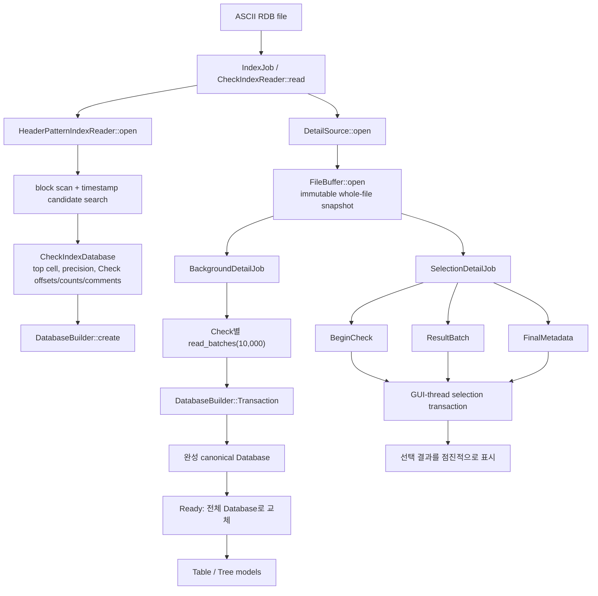

핵심 설계는 **두 단계 읽기**다.

1. **Index 단계**는 파일을 block 단위로 순차 스캔해 Check 목록과 각 Check의 시작
   byte offset만 빠르게 만든다.
2. **Detail 단계**는 index가 알려 준 offset부터 필요한 Check만 해석한다.
3. DatabaseApp은 detail 전체 적재와 선택 항목 우선 적재를 같은 immutable snapshot
   위에서 병렬로 진행한다.
4. 최종 저장 형태는 객체 그래프가 아니라 연속 flat pool을 가진 canonical
   `Database`다.

---

## 3. 입력의 논리 구조와 parser가 기대하는 형식

Parser가 해석하는 논리 단위는 다음 순서다.

```text
<top cell name> <positive database precision>

<Check name>
<current result count> <original result count> <check text line count> <executed-at>
<check text line 1>
...
<check text line N>

<p|e> <ordinal token> <coordinate count> <signature suffix...>
<tag id> <payload...>            # signature 전·geometry 중·geometry 뒤에 올 수 있음
<coordinates...>
...
```

### 3.1 Database header

`detail::parse_database_header()`는 첫 nonblank line을 다음과 같이 해석한다.

- 마지막 whitespace-delimited token은 `database_precision`이다.
- 앞부분 전체는 공백을 trim한 `top_cell_name`이다.
- precision은 classic locale로 읽은 유한한 양수 `double`이어야 한다.
- Top Cell 이름은 비어 있을 수 없다.

예상 형식은 개념적으로 다음과 같다.

```text
<Top Cell 이름: 내부 공백 허용> <precision>
```

### 3.2 RuleCheck header

`detail::parse_rule_header()`는 다음 네 부분을 읽는다.

1. 현재 Result 수
2. 원래 Result 수
3. Check text 줄 수
4. 나머지 전체 실행 시각 문자열

검증 규칙:

- 세 count는 부호 없는 64-bit 범위를 넘을 수 없다.
- Check text 줄 수는 `std::uint32_t` 범위를 넘을 수 없다.
- `current_result_count <= original_result_count`여야 한다.
- 실행 시각 문자열은 비어 있을 수 없다.

빠른 index에서는 임의의 `:`를 Check header로 오인하지 않도록 `HH:MM:SS` 범위와
주변 날짜 형태까지 검사한다. 즉, 단순 문자열 검색만으로 Check를 확정하지 않는다.

### 3.3 Result signature

`detail::parse_result_signature()`은 다음을 읽는다.

```text
p <ordinal> <coordinate-count> <suffix...>  # Polygon
e <ordinal> <coordinate-count> <suffix...>  # EdgeCluster
```

- 첫 token은 정확히 소문자 `p` 또는 `e`다.
- ordinal이 유효한 `uint32` 숫자가 아니면 parser는 Result 자체를 버리지 않고
  `ordinal = 0`으로 보존한다.
- coordinate count는 부호 없는 64-bit 값이어야 한다.
- 세 필수 token 뒤의 텍스트는 trim하여 `signature_suffix`로 보존한다.

### 3.4 Geometry

| ResultKind | 한 줄의 좌표 | 임시 저장 |
|---|---|---|
| `Polygon` | signed 64-bit `x y` | `DetailResult::vertices` |
| `EdgeCluster` | signed 64-bit `x1 y1 x2 y2` | `DetailResult::edges` |

부호 있는 좌표 parser는 `INT64_MIN`까지 직접 처리하며 overflow를 거부한다. 좌표
줄에는 요구된 숫자 외의 후행 token이 없어야 한다.

### 3.5 Tag와 Cell context

좌표로 해석되지 않는 nonblank line은 첫 token을 tag ID, 나머지를 payload로 갖는
`DetailTag` 후보가 된다.

대문자 `CN`은 특별하다.

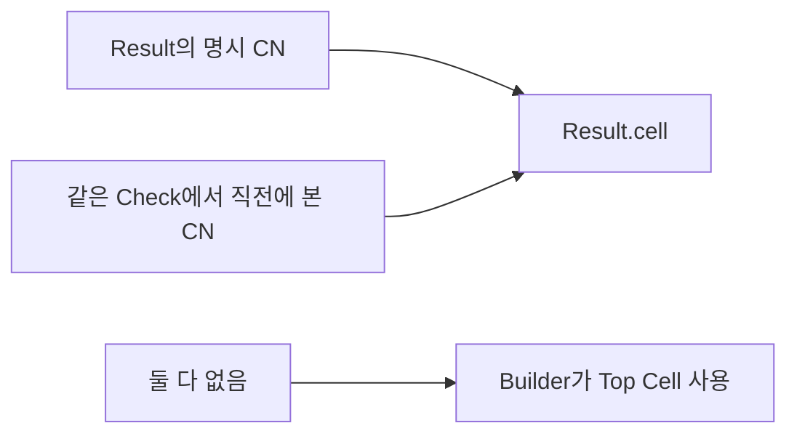

- scanner는 `CN`을 일반 property 목록에서 제거한다.
- 명시 CN을 만나면 같은 Check의 current cell context를 갱신한다.
- 이후 CN이 없는 Result는 직전 context를 이어받는다.
- Check 전체에서 CN이 없으면 `DatabaseBuilder::intern_cell()`이 Top Cell ID를 쓴다.
- 소문자 `cn`이나 다른 ID는 일반 tag다.

원본 `EL`, `EW`, `PA`, `PP` tag payload는 parser가 계산값으로 덮어쓰지 않는다.
계산 metric은 앱의 `ResultFinalizer`가 별도 필드에 기록한다.

---

## 4. 공용 scanner 계층

### 4.1 `FileBuffer`: immutable whole-file snapshot

`DetailSource::open(path)`은 `FileBuffer::open(path)`을 호출한다.

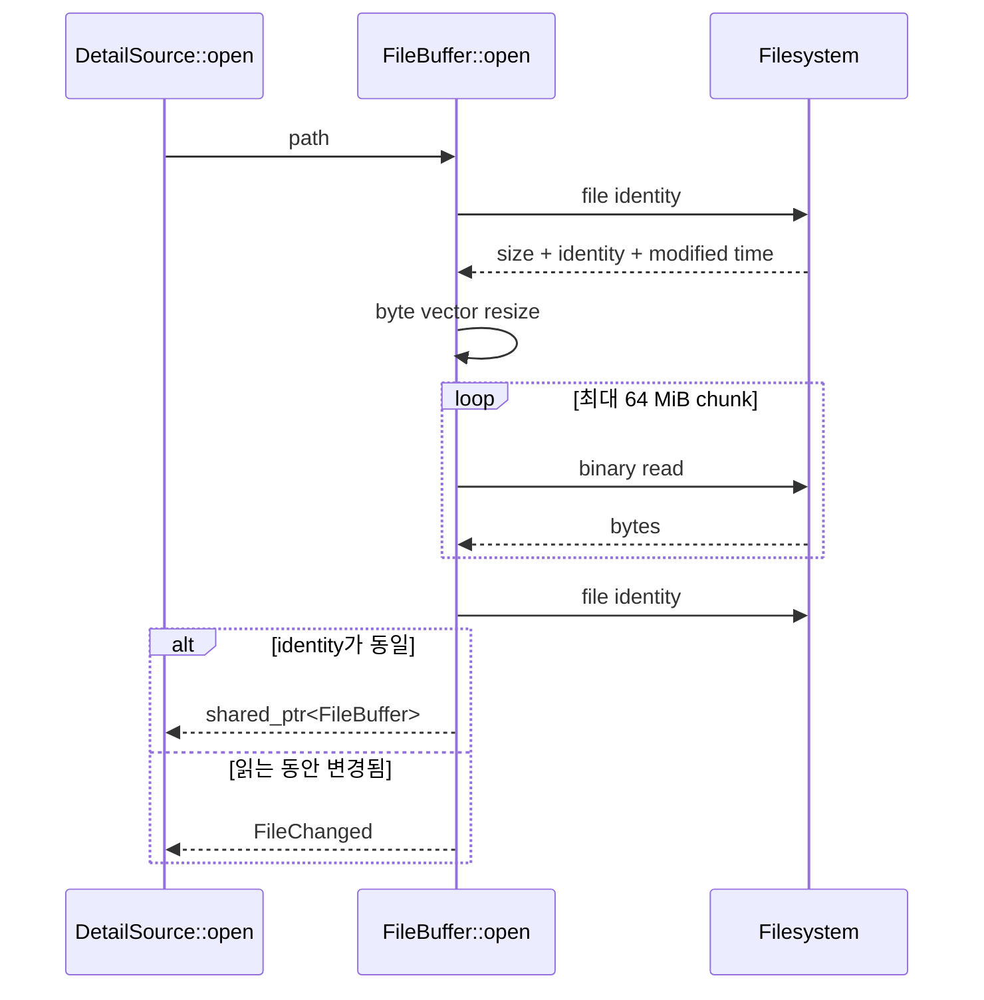

identity 구성:

- Windows: volume serial, file index, file size, last-write time
- POSIX: device, inode, file size, nanosecond 수정 시각

snapshot은 `shared_ptr<FileBuffer>`로 공유된다. 따라서 background parser와 selection
parser가 파일을 다시 읽거나 byte vector를 복제하지 않는다.

Detail parse가 끝난 뒤에도 `source_size_unchanged()`를 다시 확인한다. snapshot 자체는
일관되더라도 원본 파일이 바뀌었다면 성공으로 보고하지 않고 `FileChanged`를 반환한다.

### 4.2 `LineCursor`: offset을 보존하는 zero-copy line view

`LineCursor`는 snapshot byte 범위 위에서 동작한다.

- `reset(file, offset)`: Check 시작 offset으로 이동
- `next(Line&)`: `memchr('\n')`으로 다음 line을 찾음
- CRLF 입력에서는 line 끝의 `\r`을 제외
- `Line::text`: 원본 byte를 가리키는 `Span`
- `Line::offset`: 파일 시작 기준 byte offset
- `mark()/restore()`: 한 줄 이상 look-ahead 후 원위치 복구

문자열 객체는 실제 metadata를 보존할 때만 만든다. token 탐색과 숫자 검증은 대부분
`Span` 위에서 수행한다.

### 4.3 숫자 parser

| 함수 | 계약 |
|---|---|
| `parse_unsigned()` | decimal digit만 허용, `uint64_t` overflow 검출 |
| `parse_signed()` | 선택적 `+/-`, `int64_t` 전체 범위 지원 |
| `parse_double_value()` | classic locale, token 전체 소비, finite 값만 허용 |
| `next_word()` | horizontal/일반 scanner space를 건너 다음 token span 반환 |

숫자 변환 실패를 0으로 조용히 대체하지 않는다. Result ordinal만 호환성 때문에 별도의
정책으로 0을 사용한다.

---

## 5. Phase 1 — 빠른 Check index

진입점은 `CheckIndexReader::read(path, options)`다.

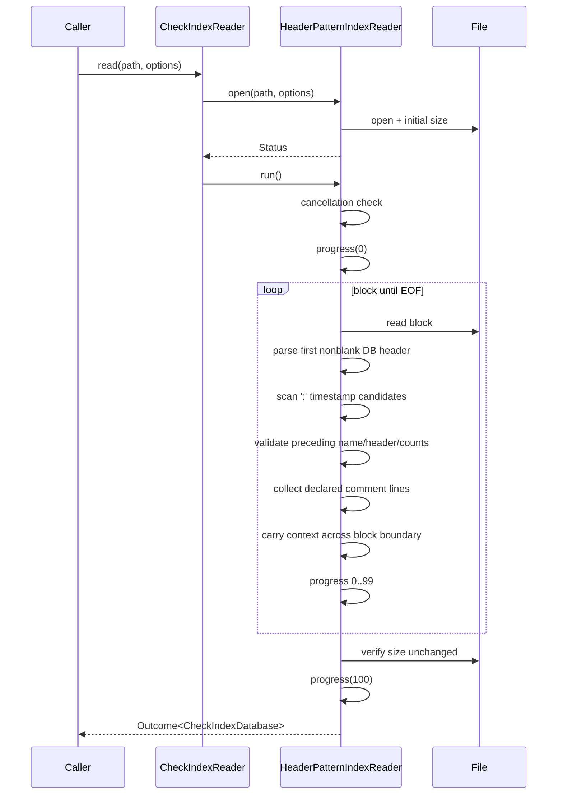

### 5.1 옵션과 buffer

`FastCheckIndexOptions` 기본값:

| 옵션 | 기본값 | 목적 |
|---|---:|---|
| `read_buffer_bytes` | 16 MiB | 한 번에 읽는 주 block |
| `context_bytes` | 64 KiB | block 경계에 걸친 이름/header/comment 보존 |
| `progress_callback` | 없음 | 증가하는 0..100 진행률 및 callback 취소 |
| `is_cancelled` | 없음 | 외부 cancellation polling |

buffer는 `read_buffer_bytes + context_bytes`로 시작한다. header나 comment line이
context보다 길어 소비 가능한 byte가 없다면 capacity 한도 안에서 buffer를 두 배로
늘린다.

### 5.2 후보 탐색이 동작하는 순서

1. 첫 nonblank line을 Database header로 해석한다.
2. EOF가 아니면 마지막 16 byte를 look-ahead 영역으로 남긴다.
3. scan 범위에서 `memchr(':')`로 colon 후보를 찾는다.
4. `timestamp_colon()`이 `HH:MM:SS` 숫자 범위를 검사한다.
5. colon이 포함된 줄 앞에서 세 decimal count와 날짜 모양을 검사한다.
6. 바로 전 줄을 Check name으로 해석한다.
7. Check offset은 **Check name line의 시작 byte**로 저장한다.
8. 선언된 Check text 줄 수만큼 comment를 같은 순차 scan에서 수집한다.
9. 이미 comment로 소비한 영역은 `covered_until`로 표시해 내부의 timestamp-like
   문자열을 새 Check로 중복 인식하지 않는다.

### 5.3 block 경계 처리

다음 block으로 넘길 최소 범위는 다음 중 더 이른 지점부터다.

- 현재 미완성 line 시작
- Check name을 찾기 위한 이전 line 시작
- 수집 중인 comment의 아직 소비하지 않은 지점
- `context_bytes`가 요구하는 보존 지점

필요한 byte는 `memmove`로 buffer 앞에 이동하고 `buffer_offset_`을 증가시킨다. 모든
오류 offset은 이 절대 offset과 buffer 내부 위치를 합산해 만든다.

### 5.4 진행률과 취소

- 시작 전에 cancellation을 확인하고 progress 0을 보낸다.
- 읽은 byte / 최초 파일 크기 비율을 0..99로 변환한다.
- 같은 값 또는 감소한 값은 callback에 다시 보내지 않는다.
- callback이 `FlowControl::Cancel`을 반환하거나 `is_cancelled()`가 true면
  `OutcomeState::Cancelled`다.
- EOF 후 파일 크기가 최초 값과 같은지 확인한 다음에만 100을 보낸다.

### 5.5 index 출력

`CheckIndexDatabase`:

- `top_cell_name`
- `database_precision`
- 입력 순서 그대로의 `checks`

각 `CheckIndexEntry`:

- `name`
- 여러 Check text 줄을 `\n`으로 합친 `comment`
- Check name line의 `offset`
- `geometry_count`(현재 Result 수)
- `original_result_count`
- `check_text_line_count`

이 단계에서는 Result, tag, vertex, edge를 만들지 않는다.

---

## 6. Phase 2 — DetailSource와 Check detail scan

두 공개 경로는 내부적으로 동일한 `scan_detail()`을 사용한다.

| API | `ScanOptions` | 결과 |
|---|---|---|
| `read_whole(offset)` | `collect_results = true` | 모든 Result를 `CheckDetail::results`에 보관 |
| `read_batches(offset, options)` | `collect_results = false` | Result를 callback으로 move 전달, metadata만 반환 |

### 6.1 Check 시작부

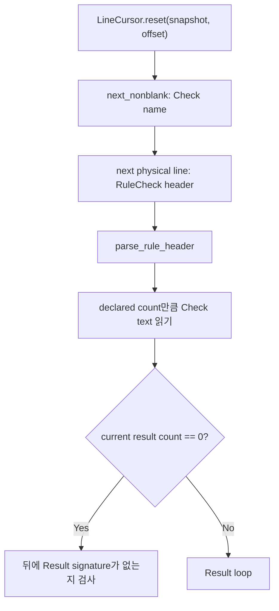

Check header 뒤의 Check text는 blank 여부와 관계없이 **선언된 물리 줄 수만큼** 읽는다.
EOF가 먼저 오면 `TruncatedInput`이다.

Result count가 0인데 다음 nonblank line이 Result signature라면 index/header와 실제
내용이 모순되므로 `InvalidFormat`이다.

### 6.2 Result 하나의 상태 흐름

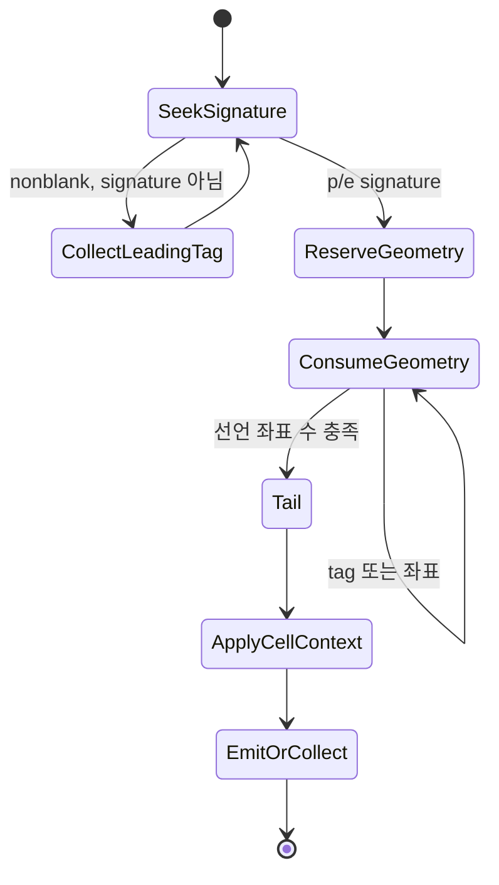

세부 순서:

1. 다음 Result signature를 찾을 때까지 nonblank line을 leading tag로 보관한다.
2. signature의 kind, ordinal, coordinate count, suffix를 `DetailResult`에 기록한다.
3. 선언 coordinate count를 기준으로 정확한 geometry vector를 reserve한다.
4. 좌표가 성공적으로 해석될 때만 `seen`을 증가시킨다.
5. 좌표가 아닌 줄은 tag로 보관하므로 tag가 geometry 줄 사이에 있어도 된다.
6. 선언 좌표를 다 읽기 전에 새 Result signature를 만나면 `TruncatedInput`이다.
7. geometry 뒤의 tail tag를 수집한다.
8. `CN`을 제거하고 Result cell context를 적용한다.
9. whole 모드면 `CheckDetail::results`에 move하고, batch 모드면 batch에 move한다.

### 6.3 중간 Result tail과 마지막 Result tail

중간 Result는 다음 Result signature를 look-ahead로 발견하면 cursor를 restore하여
다음 loop가 그 signature부터 다시 읽게 한다.

마지막 Result는 더 복잡하다.

- 추가 Result signature가 나오면 header의 Result count보다 실제 목록이 많으므로
  `InvalidFormat`이다.
- `candidate line + possible next header line`을 함께 look-ahead한다.
- possible next line이 유효한 RuleCheck header라면 candidate는 다음 Check 이름으로
  간주하고 현재 Result tail 수집을 종료한다.
- 그렇지 않으면 candidate를 현재 Result의 tag로 추가하고 계속한다.

이 경계 판별 덕분에 detail parser는 다음 Check offset을 별도로 전달받지 않고도 현재
Check의 끝을 찾는다.

### 6.4 batch 전달

기본 `batch_size`는 10,000이다.

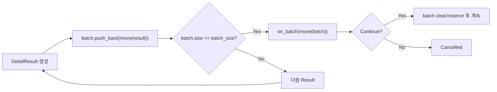

계약:

- `batch_size > 0`
- callback 필수
- 마지막 잔여 batch를 제외한 모든 batch는 정확히 같은 크기
- callback은 `vector<DetailResult>&&`의 소유권을 받음
- callback의 Cancel은 parser 실패가 아니라 cancellation
- 반환 metadata의 `parsed_result_count`는 성공적으로 만들어 callback에 넘긴 Result 수

### 6.5 detail 종료 검증

parse 완료 후 원본 파일 identity를 snapshot 생성 시점과 다시 비교한다.

- snapshot parse 결과가 성공이어도 원본이 바뀌면 `FileChanged`
- cancellation은 원본 변경 검사보다 먼저 반환
- parsing 실패는 byte offset과 `ErrorStage::Detail`을 보존

---

## 7. Phase 3 — canonical Database 변환

### 7.1 flat-pool 구조

```text
Database
├─ StringTable strings
├─ vector<RuleCheck> rule_checks
├─ vector<Result> results
├─ vector<TaggedValue> tagged_values
├─ vector<Point> vertices
├─ vector<Segment> edges
└─ vector<StringId> check_text_lines
```

참조 관계:

```text
RuleCheck.results       -> Database.results의 Range
RuleCheck.check_text    -> Database.check_text_lines의 Range
Result.properties       -> Database.tagged_values의 Range
Result.geometry         -> Polygon이면 vertices Range
                           EdgeCluster면 edges Range
StringId                -> StringTable record
```

Result별 heap 객체를 중첩 소유하지 않으므로 큰 파일에서 allocation 수와 pointer chasing을
줄인다. Check와 Result의 입력 순서는 pool append 순서로 보존된다.

### 7.2 `DatabaseBuilder::create()`

index metadata를 canonical Database의 skeleton으로 바꾼다.

1. Top Cell이 비어 있지 않은지 확인한다.
2. precision이 유한한 양수인지 확인한다.
3. Check 수와 string record/byte 합계의 capacity를 검증한다.
4. 필요한 StringTable과 RuleCheck capacity를 미리 reserve한다.
5. Top Cell을 intern한다.
6. 각 index entry의 이름, comment, offset, counts를 `RuleCheck`로 만든다.
7. detail pool은 비어 있고 `detail_loaded == false`인 Database를 반환한다.

### 7.3 Check transaction

모든 detail 적재는 `begin_check(id)` → `append(batch)*` → `commit(detail)` 순서를 따른다.

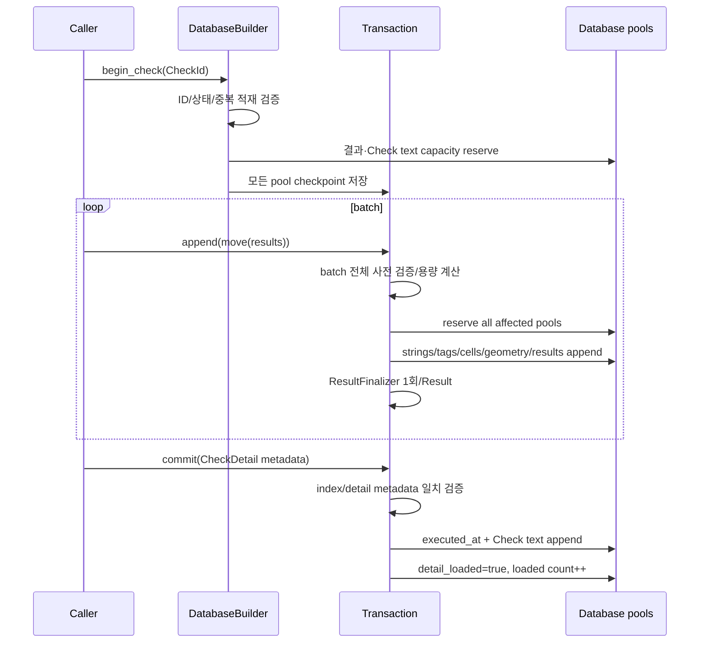

한 builder에는 동시에 하나의 active transaction만 허용된다. 이미 detail이 적재된
Check에는 새 transaction을 열 수 없다.

### 7.4 append 전 사전 검증

`validate_append()`는 pool을 변경하기 전에 batch 전체를 검사한다.

- Result kind가 Polygon 또는 EdgeCluster인지
- Polygon에 edge가, EdgeCluster에 vertex가 섞이지 않았는지
- property/vertex/edge/string record/string byte 합계가 한도를 넘지 않는지
- property ID가 비어 있지 않은지
- 새 cell/tag interning에 필요한 항목 수
- signature suffix와 payload string 용량

그 후 **모든 관련 pool과 interner를 먼저 reserve**하고 append를 시작한다. 예상 가능한
capacity 오류를 부분 append 이후가 아니라 변경 전에 발견하기 위한 순서다.

### 7.5 Result append

각 `DetailResult`는 다음 순서로 canonical `Result`가 된다.

1. kind와 ordinal 복사
2. cell 이름 intern; 비어 있거나 Top Cell과 같으면 Top Cell ID 사용
3. signature suffix를 StringTable에 추가
4. property ID는 intern하고 payload는 원문 string으로 저장
5. `properties` Range 설정
6. vertices 또는 edges를 해당 pool로 move-insert
7. `geometry` Range 설정
8. 선택적 `ResultFinalizer(database, result)` 호출
9. 완성 Result를 results pool에 추가
10. 해당 RuleCheck의 results count 갱신

DatabaseApp의 finalizer는 원본 tag와 별개로 다음 계산 필드를 채운다.

- `result.ew = UserProfile::GetEW(...)`
- `result.el = UserProfile::GetEL(...)`
- `result.pp = UserProfile::GetPP(...)`
- `result.pa = UserProfile::GetPA(...)`

### 7.6 commit 검증

`commit()`은 index 단계와 detail 단계가 같은 Check를 가리키는지 검증한다.

- Check name
- Check 시작 offset
- current/original Result count
- 실제 append된 Result count
- 선언/실제 Check text 줄 수
- `current <= original`

하나라도 다르면 `InvalidFormat / DatabaseBuild`이며 transaction은 완료되지 않는다.
성공하면 실행 시각과 Check text를 StringTable/pool에 추가하고 `detail_loaded`와 전체
loaded Check count를 갱신한다.

### 7.7 rollback

transaction 시작 시 다음 checkpoint를 저장한다.

- StringTable checkpoint와 string count
- 해당 RuleCheck 원본 값
- results, vertices, edges, tagged_values, check_text_lines 크기
- loaded Check count
- intern된 tag-name pool 크기
- transaction generation

다음 경우 `rollback_transaction()`이 Check 단위 변경 전체를 되돌린다.

- `cancel()` 호출
- commit하지 않고 destructor 도달
- move assignment로 기존 active transaction을 교체
- append/commit 실패 후 caller가 scope를 빠져나감

rollback은 pool resize, RuleCheck 복원, StringTable rollback, 새 cell/tag interner 항목
삭제까지 수행한다. 이는 exception unwinding에 의존하지 않는 명시적 RAII 안전장치다.

---

## 8. 동기식 `IndexedRdbFile` 흐름

`IndexedRdbFile`은 CLI나 단순 호출자를 위한 facade다.

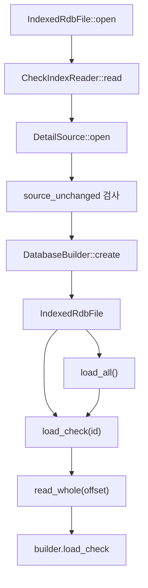

- index가 끝난 뒤 snapshot을 열고, snapshot 원본이 현재도 동일한지 검사한다.
- index 단계는 종료 시 **파일 크기**만 재검증하고 identity/mtime을 보존하지 않는다.
  따라서 index와 snapshot 사이에 파일이 **같은 크기로 교체**되는 경우까지 두 단계가
  같은 파일 세대를 읽었다고 증명하지는 못한다. 파일 크기가 달라지거나 snapshot 생성
  중·이후 identity가 바뀌는 경우에는 `FileChanged`가 된다.
- `load_check()`는 ID를 검증하고 이미 적재된 Check면 성공으로 no-op한다.
- `load_all()`은 Check ID 순서로 아직 적재되지 않은 detail을 읽는다.
- 이 facade는 whole-detail 경로를 사용하므로 대용량 GUI 점진 표시에는 DatabaseApp의
  batch worker 경로가 더 적합하다.

---

## 9. DatabaseApp 비동기 흐름

### 9.1 Controller 상태

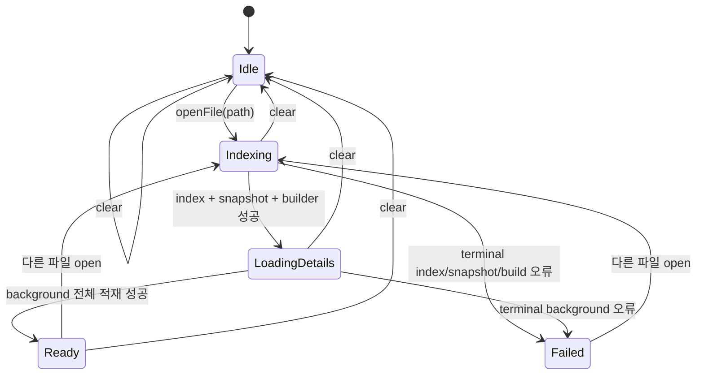

progress의 의미:

- `Indexing`: index byte scan 0..100
- index 완료 후 `LoadingDetails`로 바꾸면서 progress를 0으로 reset
- background Check 완료 비율은 0..99로 표시
- 완성 Database를 설치한 뒤에만 Ready + 100

따라서 **Index 100%와 전체 detail 100%는 서로 다른 단계**다.

### 9.2 `IndexJob`

`openFile()`은 기존 selection/background/index job을 동기적으로 취소·join한 뒤
`generation_`을 증가시키고 `IndexJob`을 시작한다.

`IndexJob::run()`:

1. cancellation과 progress callback을 가진 `FastCheckIndexOptions` 구성
2. `CheckIndexReader().read()` 실행
3. `DetailSource::open()`으로 immutable snapshot 생성
4. `DatabaseBuilder::create(index, app_finalizer())` 실행
5. index, source, builder를 `RdbIndexPayload`로 한 번만 move 전달
6. progress 100과 terminal result signal 발행

`takeResult()`는 ownership을 한 번만 이동하고 내부 결과를 비운다.

### 9.3 index 직후 두 갈래

`onIndexResult()`가 성공 payload를 설치하면 즉시:

- index-only Database를 UI에 전달해 Check 목록을 표시
- `BackgroundDetailJob`으로 모든 Check 적재 시작
- index 중 들어온 pending selection이 있으면 `SelectionDetailJob`도 시작

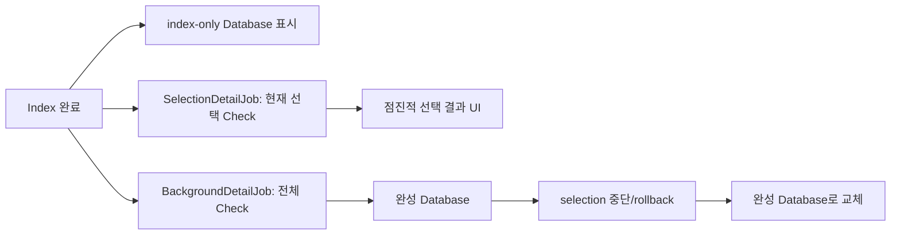

### 9.4 `BackgroundDetailJob`

별도의 새 `DatabaseBuilder`를 index로부터 만든다. 각 Check를 입력 순서대로 처리한다.

1. `begin_check(i)`
2. `read_batches(offset, batch_size=10000)`
3. callback에서 `transaction.append(move(batch))`
4. parser metadata로 `transaction.commit()`
5. 완료 Check 수 / 전체 Check 수를 progress로 발행
6. 모든 Check가 성공하면 완성 Database ownership을 controller에 전달

callback append가 실패하면 callback은 Cancel을 반환하지만, worker는 별도로 저장한
`callback_status`를 먼저 확인하여 이를 사용자 cancellation이 아닌 정확한 build 실패로
보고한다.

### 9.5 `SelectionDetailJob`

선택 전용 builder는 background builder와 분리된다. worker는 Database를 직접 쓰지 않고
다음 세 종류 chunk만 Qt queued signal로 보낸다.

| Chunk | 의미 | GUI thread 동작 |
|---|---|---|
| `BeginCheck` | 새 Check 시작 | `selection_builder_.begin_check(id)` |
| `ResultBatch` | 최대 10,000 Result | active transaction에 append |
| `FinalMetadata` | Check metadata와 Check text | transaction commit |

Result batch와 metadata는 `shared_ptr`로 소유권을 전달해 queued signal 복사를 가볍게
한다.

### 9.6 bounded backpressure

`RdbBoundedGate(2)`는 GUI thread가 아직 소비하지 않은 selection chunk를 최대 2개로
제한한다.

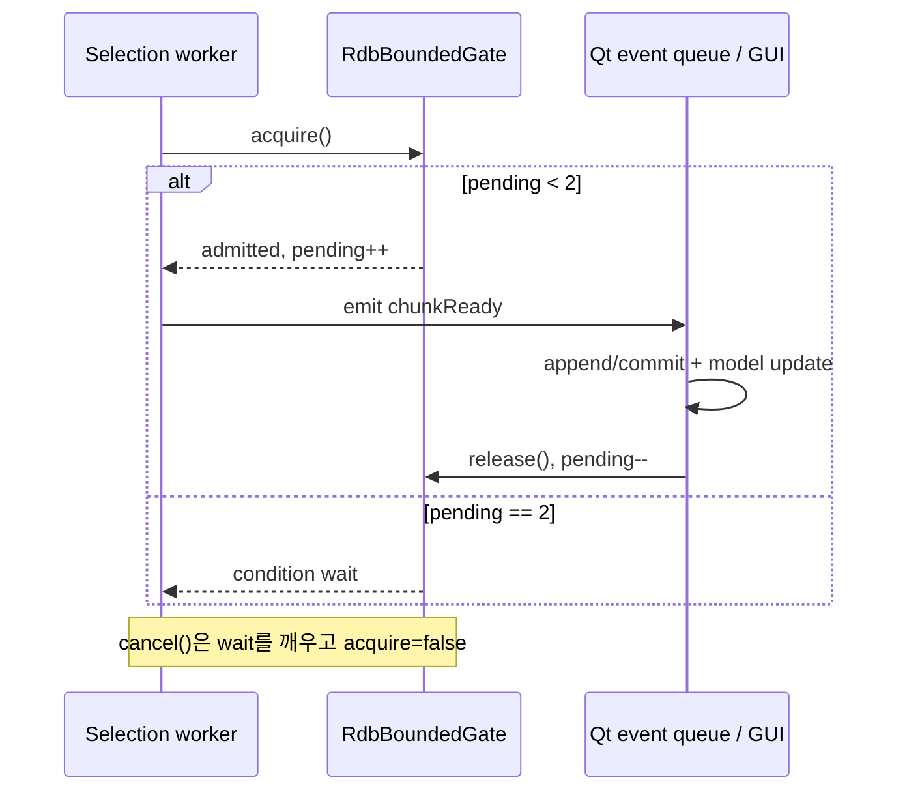

이 제한이 없으면 parser가 GUI보다 빠를 때 10,000개 batch가 event queue에 무제한
쌓여 peak memory가 커질 수 있다.

### 9.7 stale 결과 차단

두 monotonically increasing ID를 사용한다.

- `generation_`: 열린 파일 세대
- `request_id_`: 선택 요청 세대

모든 callback은 현재 ID와 일치하는지 확인한다. 이전 파일이나 이전 선택에서 늦게 온
chunk/result는 Database를 수정하지 않고 gate만 release한다.

reselection 흐름:

1. `request_id_` 증가
2. 최신 selected Check 목록 저장
3. 이전 selection gate cancel
4. 이전 worker cancel + wait
5. 미완료 transaction rollback
6. 새 selection builder와 gate 생성
7. 새 request ID로 worker 시작

전체 background가 끝나면 selection worker를 중단하고 request ID를 증가시킨 뒤 완성
Database를 설치한다. 임시 선택 Database가 최종 전체 Database를 덮어쓰지 못한다.

---

## 10. 오류와 cancellation 전파

### 10.1 상태 구분

| 상태 | 의미 |
|---|---|
| `Ok` | operation이 계약대로 완료됨 |
| `Cancelled` | 사용자/상위 callback이 의도적으로 중단함 |
| `Failed` | 형식, I/O, 상태, capacity 또는 callback 오류 |

취소는 `ErrorCode::None`이지만 stage와 가능한 byte offset을 갖는다.

### 10.2 주요 ErrorCode가 발생하는 위치

| ErrorCode | 대표 조건 |
|---|---|
| `InvalidArgument` | 빈 path, 0 batch size, 너무 작은 index buffer/context, EOF 밖 offset |
| `InvalidState` | 열리지 않은 DetailSource, 초기화되지 않은 builder, active transaction 충돌 |
| `InvalidId` | 존재하지 않는 Check ID |
| `FileOpenFailed` | index 또는 snapshot file open/stat 실패 |
| `FileSizeFailed` | file size/identity 조회 실패 |
| `FileReadFailed` | block 또는 snapshot 전체 읽기 실패 |
| `FileChanged` | index 중 크기 변경, snapshot 생성 중 identity 변경, snapshot 이후 원본 변경 |
| `InvalidFormat` | header/count/geometry kind/metadata 불일치, 실제 Result 과다 |
| `TruncatedInput` | 선언된 comment/check text/geometry/Result가 EOF 전에 끝남 |
| `CapacityExceeded` | 64-bit, `size_t`, vector/StringTable capacity 초과 |
| `CallbackFailed` | callback 기반 확장 지점의 명시적 실패용 코드 |

### 10.3 ErrorStage

- `Index`: 빠른 index scan
- `Detail`: Check detail scan과 snapshot
- `DatabaseBuild`: canonical pool 검증/적재
- `Selection`: DatabaseApp 선택 worker/controller 경계
- `Model`, `Controller`: 앱 후속 처리

DatabaseApp selection worker는 detail parser 오류의 code와 offset을 유지하면서 stage를
`Selection`으로 바꿔 사용자에게 어느 경로가 실패했는지 알린다.

### 10.4 terminal 오류와 nonterminal 오류

- index/background 전체 적재 오류는 terminal이며 controller를 `Failed`로 바꾼다.
- selection 오류는 nonterminal이다. 현재 선택은 실패할 수 있지만 background 전체
  parsing은 계속된다.
- cancellation은 일반적으로 error signal을 내지 않는다.

---

## 11. 성능과 메모리 설계

### 11.1 불필요한 작업을 피하는 지점

| 설계 | 효과 |
|---|---|
| index/detail 분리 | Check 목록을 위해 geometry 전체를 만들지 않음 |
| block index scan | 대용량 파일을 index 단계에서 통째로 메모리에 올리지 않음 |
| shared immutable snapshot | background와 selection의 중복 file read/byte copy 제거 |
| `Span` + `LineCursor` | token/line마다 string allocation하지 않음 |
| `memchr` 기반 newline/colon 검색 | 순차 byte scan의 library 최적화 활용 |
| 10,000 Result batch | 임시 DetailResult peak 크기 제한 |
| move callback | batch vector와 내부 geometry 소유권 복사 제거 |
| flat pools + Range | Result별 heap allocation과 pointer graph 제거 |
| 선검증 후 reserve | append 중 반복 realloc과 부분 상태 최소화 |
| cell/tag interning | 반복되는 ID/name string 중복 저장 감소 |
| pending chunk 최대 2 | GUI event queue에 대한 backpressure |

### 11.2 peak memory 관점

DetailSource가 전체 파일 snapshot을 한 번 보유하므로 기본 peak에는 최소한 파일 크기만큼의
byte vector가 포함된다. 대신 두 worker가 별도 snapshot을 만들지 않는다.

background와 selection은 각각 별도 canonical Database를 만들 수 있으므로
`LoadingDetails` 중에는 다음이 동시에 존재할 수 있다.

- immutable file snapshot
- index-only Database/builder
- 성장 중인 background Database
- 현재 선택만 담은 selection Database
- 최대 2개의 queued selection chunk

Ready 전환 시 selection을 취소하고 최종 Database로 교체해 임시 구조의 수명을 끝낸다.

### 11.3 writer 규칙

- snapshot은 immutable이므로 여러 reader가 공유할 수 있다.
- 하나의 mutable `DatabaseBuilder`에는 writer가 하나여야 한다.
- transaction은 builder당 하나만 active다.
- background builder는 background thread에서만 쓴다.
- selection builder는 GUI thread에서 queued chunk를 소비하며 쓴다.
- 완성 Database는 GUI 모델에서 read-only로 공유한다.

---

## 12. 유지해야 하는 핵심 불변식

1. Check, Result, geometry의 canonical 저장 순서는 입력 순서다.
2. Check offset은 detail parser가 다시 읽을 수 있는 Check name line 시작 byte다.
3. index count와 detail metadata는 commit에서 반드시 재검증한다.
4. 하나의 Result geometry는 kind와 일치하는 pool 하나만 사용한다.
5. `CN`은 일반 property가 아니라 Result cell context다.
6. 원본 `EL/EW/PA/PP` tag와 계산 `#EL/#EW/#PA/#PP` 의미를 섞지 않는다.
7. expected failure와 cancellation은 exception이 아니라 명시적 결과로 전달한다.
8. 실패하거나 중단된 Check transaction은 부분 Result를 남기지 않는다.
9. index 진행률 100과 전체 detail 완료 100을 같은 사건으로 취급하지 않는다.
10. stale generation/request 결과는 현재 Database에 반영하지 않는다.
11. selection queue는 bounded 상태를 유지하고 cancel 시 blocked producer를 깨운다.
12. full background Database가 완료되면 임시 selection Database보다 우선한다.
13. parser가 snapshot을 성공적으로 읽었더라도 원본 identity가 바뀌면 성공으로 보고하지
    않는다.
14. 외부 Check ID는 `find_check()` 등 검증 API를 거친다.
15. GUI 정렬/필터링은 canonical pool 순서를 변경하지 않는다.

---

## 13. 테스트가 검증하는 흐름

### 13.1 Parser 테스트

| Target | 주요 검증 |
|---|---|
| `rdb-parser-tests` | 실제 fixture index/detail/facade, Result와 geometry 해석 |
| `rdb-check-index-header-test` | header candidate, block/context 경계, count overflow, 오류 offset |
| `rdb-unified-database-test` | shared snapshot, builder, batch, rollback, ID, metadata 일치 |

중점 계약:

- 성공/실패/cancelled 상태 구분
- 정확한 `ErrorCode`, `ErrorStage`, byte offset
- source 변경 감지
- batch 크기와 move 전달
- CN inheritance와 Top Cell fallback
- index/detail mismatch 거부
- transaction cancel/destructor rollback
- pool index와 좌표의 64-bit 범위

### 13.2 DatabaseApp worker 테스트

[`database_app_worker_test.cpp`](../DatabaseApp/tests/database_app_worker_test.cpp)는 다음을
직접 실행한다.

- bounded gate가 두 번째 producer를 block하고 cancel 시 즉시 깨우는지
- queued metadata가 deep copy 대신 shared ownership을 유지하는지
- selection batch append 때 Result model이 점진적으로 늘어나는지
- rollback 후 임시 row/header가 사라지는지
- IndexJob 결과 ownership이 한 번만 이동하는지
- index 진행률이 100에 도달하는지
- index 중 요청한 selection이 보존되어 detail 완료 전에 표시되는지
- reselection이 stale 요청을 취소하는지
- selection 오류가 background 전체 적재를 중단하지 않는지
- full completion이 최종적으로 Ready와 progress 100을 만드는지
- `clear()`가 owned worker를 동기적으로 취소하는지

---

## 14. 변경 유형별 확인 체크리스트

### index scanner를 변경할 때

- [ ] Database header의 마지막 precision token 규칙이 유지되는가?
- [ ] timestamp-like comment/tag가 Check header로 오인되지 않는가?
- [ ] name/header/comment가 block 경계에 걸쳐도 같은 offset과 comment가 나오는가?
- [ ] progress가 증가만 하고 성공 검증 전에 100을 보내지 않는가?
- [ ] EOF, overflow, truncated comment의 code/stage/offset이 정확한가?

### detail grammar를 변경할 때

- [ ] Polygon과 EdgeCluster 좌표 수를 정확히 소비하는가?
- [ ] geometry 사이의 tag와 Result tail tag가 보존되는가?
- [ ] 마지막 Result와 다음 Check 경계를 잘못 소비하지 않는가?
- [ ] CN inheritance와 일반 tag 제거 규칙이 유지되는가?
- [ ] whole과 batch 경로가 동일한 metadata/Result 의미를 만드는가?

### DatabaseBuilder를 변경할 때

- [ ] batch 전체 검증과 모든 reserve가 실제 append보다 먼저 실행되는가?
- [ ] 새 pool/interner도 transaction checkpoint와 rollback에 포함되는가?
- [ ] index/detail metadata mismatch가 commit을 통과하지 않는가?
- [ ] finalizer가 Result마다 정확히 한 번 호출되는가?
- [ ] canonical 입력 순서와 Range가 유지되는가?

### DatabaseApp worker를 변경할 때

- [ ] background와 selection이 snapshot을 복사하지 않고 공유하는가?
- [ ] mutable builder의 writer가 한 thread로 제한되는가?
- [ ] 모든 queued payload에 generation/request ID가 있는가?
- [ ] stale chunk를 버릴 때 gate release를 빠뜨리지 않는가?
- [ ] cancel이 gate wait, worker, transaction을 모두 종료하는가?
- [ ] background 완료가 selection 완료와 race해도 최종 Database가 일관적인가?
- [ ] Index 100%와 전체 detail 100% UI semantics가 분리되는가?

---

## 15. 빌드와 검증

Parser:

```bash
cmake -S . -B build-parser -DCMAKE_BUILD_TYPE=Release
cmake --build build-parser -j
ctest --test-dir build-parser --output-on-failure
```

DatabaseApp:

```bash
cmake -S DatabaseApp -B build-database-app \
  -DCMAKE_BUILD_TYPE=Release \
  -DBUILD_TESTING=ON \
  -DCMAKE_PREFIX_PATH=/opt/homebrew/opt/qt@5
cmake --build build-database-app -j
ctest --test-dir build-database-app --output-on-failure
```

두 target 모두 no-exception 계약을 유지해야 한다.

- GNU/Clang: `-fno-exceptions`
- compile definition: `QT_NO_EXCEPTIONS`
- source gate: Parser, DatabaseApp, tests, benchmark의 `throw`/`try`/`catch` token 금지

---

## 16. 관련 문서

- [Parser 상세 설계](Parser.md)
- [DatabaseApp 상세 설계](DatabaseApp.md)
- [프로젝트 문서 목차](README.md)
- [Parser 공개 사용 안내](../README.md)
- [DatabaseApp 사용 안내](../DatabaseApp/README.md)
